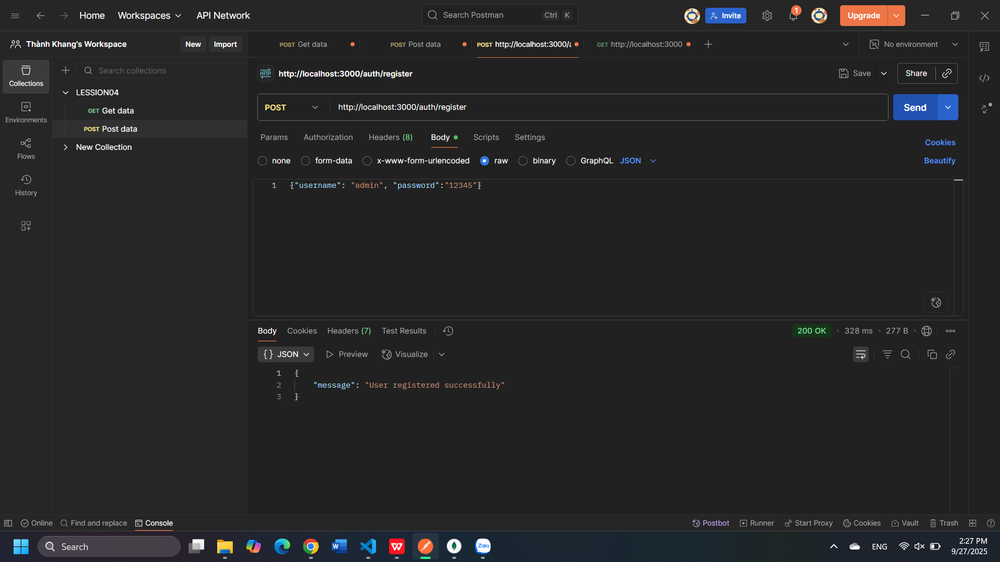
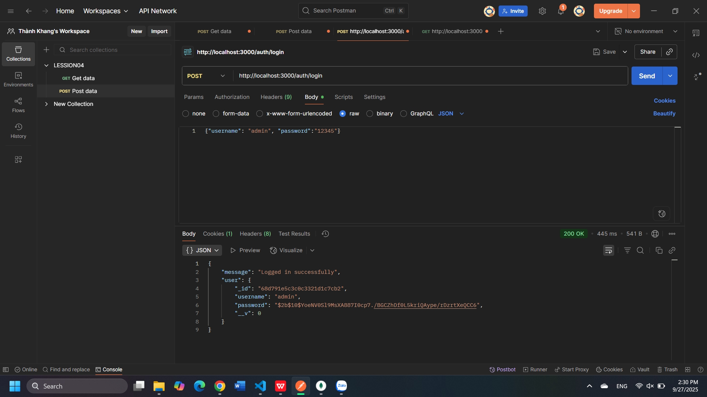

# Local Passport Authentication Service
## Giới thiệu
Repo này minh họa cơ chế xác thực trong Node.js bằng **Passport Local Strategy**.  
Chức năng chính:
- Đăng ký (Register)
- Đăng nhập (Login)

Kết quả test được lưu trong thư mục `result_test_img/`.

---

## 📸 Kết quả test

### 1. Đăng ký (Register)

### 2. Đăng nhập (Login)

---

##  Kết luận
- Người dùng có thể **đăng ký** tài khoản mới.  
- Sau khi đăng nhập thành công, server xác thực bằng **Passport Local Strategy**.  
